# 《见好不收》玩法—UI绑定审计

审计基线：当前工作区、1280×720 Phaser 运行版本。本文只记录真实代码路径；没有存档、背包、设置等功能时不以规划功能冒充现状。

## 输入焦点规则

|优先级|状态|唯一输入拥有者|E / Enter|ESC|WASD / 方向|鼠标|
|---:|---|---|---|---|---|---|
|1|返回主菜单确认|`PauseMenuScene` 确认层|确认当前按钮|取消确认|切换焦点|按钮悬停/点击|
|2|暂停|`PauseMenuScene`|确认当前按钮|继续游戏|切换焦点|按钮悬停/点击|
|3|专注操作（清理/观察/鉴定/处置/藏图）|`ShopGrowthScene.focusMode`|情境确认|关闭专注层，回店内|选项/旋转|擦拭、热点、卡片|
|4|墓穴近看/撤离确认/完成|`TombScene` 对应面板|拿取/放置/确认/转场|逐层关闭；完成态 ESC 也回店|通常禁用移动|瞄准仍可能保留|
|5|对话/选择|首次委托或旧结算场景|推进/确认|暂停|A/D 选项|当前选择卡支持悬停|
|6|自由探索|Player + 当前场景|最近的单一交互|暂停|移动|墓穴瞄灯方向|

## 绑定表

|ID|玩法|触发条件|玩家输入|当前UI|真实数据|成功结果|失败/边界|取消与ESC|新UI必须保留|
|---|---|---|---|---|---|---|---|---|---|
|G01|开始游戏|标题场景加载|鼠标点击开始|标题、唯一开始按钮|无存档字段|进入三幕故事介绍|没有“继续”、存档槽或禁用态|无返回层|开始动作、按钮反馈、标题可读性|
|G02|故事介绍|新游戏后|E/Enter推进，S跳过|双语叙述、抽象图形、进度/提示|`STORY_ACTS`、当前幕索引|进入首次古玩店|快速连按由转场Tween锁控制|ESC打开暂停|推进、跳过、当前段落层级|
|G03|首次委托自由探索|故事后进入古玩店，阶段`arriving/free-roam`|WASD，靠近后E|场景标题、目标签、近物提示|`phase`、玩家距离、铜牌状态|触发老板对话|远离柜台无交互|ESC暂停|目标、唯一近物提示、空间引导|
|G04|首次委托对话|靠近柜台按E|E/Enter推进|肖像、说话人、上下文、双语正文、段落进度|`dialogueBeats`、`conversationIndex`、gesture|进入回应选择/接受委托/离店|快速输入受动画锁限制|ESC暂停，不回上一句|说话人、正文、推进提示、段落状态|
|G05|首次委托回应选择|指定对话段落结束|A/D选择，E确认，鼠标|两张选择卡、焦点、标题|`firstMeetingResponse`|改变后续对话语气|没有错误答案|ESC暂停|两个选项、Selected/Focused、确认|
|G06|接受首次委托|老板提出委托|A/D，E确认|与回应选择共用选择面板|接受/拒绝索引|接受后进入墓穴；拒绝继续对应对话|无永久锁死|ESC暂停|选择文案、当前焦点、结果明确|
|G07|墓穴抵达介绍|进入`TombScene`|E/Enter推进|抵达卡、行囊视觉、场景标题|抵达段落索引、appearance|封门并开放探索|低帧率使用Tween/Timer|ESC暂停|短叙事、推进、转场遮罩|
|G08|墓穴探索与照明|抵达结束|WASD、鼠标瞄准、F灯|目标、携带1/1、底部操作、灯提示|`tutorialPhase`、灯亮度/方向、携带物|发现器物、推进路线|熄灯提高风险但不直接失败|ESC暂停|行动目标、F状态、携带状态、危险反馈|
|G09|靠近器物/空位/出口|最近对象在半径内且可见|E|对象旁情境提示、高亮、原位印记|`nearbyInteraction`、距离、可用性、spot|打开近看或放置/撤离|只突出最高优先级目标|ESC暂停|对象名、唯一主动作、按键、禁用/错误态|
|G10|墓穴器物近看|对器物按E|E拿取/交换/开棺/继续|器物名、描述、鉴定线索、动作、交换说明|`InvestigableObjectConfig`、携带物、棺椁状态|改变携带或开启棺椁|非便携物只能继续；满载则交换|ESC关闭近看|器物信息、情境动作、交换后果、关闭|
|G11|拿取/交换器物|近看确认|E|携带栏更新、动画、音效、老板短讯、目标更新|`CarrySystem`、locationState、disturbance|器物进入携带位|满载交换；反复拿放保持实例身份|近看ESC取消，拿取后不可撤销但可放回|携带1/1、拿取反馈、目标更新|
|G12|放置/归位器物|携带器物靠近空位|E|空位提示、原位痕迹、归位计数、成功/错误反馈|原始spot、位置匹配、`hasBeenDisturbed`|正确归位并更新计数|错误位置不完成；物理抖动不计入|自由探索ESC暂停|对应位置、正确/错误、计数、吸附结果|
|G13|危险/异常反馈|扰动、持有暴露、灯灭、错误摆放|自动|暗角、火焰、影子、脚步涟漪、老板短讯|omen、encounter state、exposure timer|提示玩家处理风险|当前没有生命/失败页；最高危险仍是环境反馈|不可取消；ESC仅暂停|危险强度、非纯颜色提示、不中断操作|
|G14|墓穴目标完成|原布局恢复且携带罗盘|自动|目标完成/出口提示|`isOriginalArrangementRestored`、`isCompassCarried`|允许出口交互|条件不足不显示出口|ESC暂停|完成反馈、出口可用、携带内容|
|G15|撤离确认|完成后在出口按E|E确认|当前携带物、警告|`DepartureChoice`|生成`TombSettlement`|可空手/带三种器物；结果不同|ESC取消回墓穴|携带摘要、确认、取消层级|
|G16|墓穴结算与回店|撤离确认后|E或ESC|首次取回结果、携带物、结算说明|`DepartureChoice`、生成的settlement|传递到`ShopGrowthScene`|快速输入用transition lock防重复|E/ESC都进入现行养成|结算物、继续动作、不可重复触发|
|G17|古玩店待处理拿取|回店且`activeLoot`有`placed=false`|靠近托盘E|紧凑目标、局部高亮、对象提示、Toast|`activeLoot`、`unloadedSettlementIds`|一件器物成为`carriedLoot`|无待处理器物时工位不可用|ESC暂停|器物可见、拿起反馈、下一工位引导|
|G18|放到清理台|持有未处置器物靠近工作台|E|对象提示、工作台高亮|`carriedLoot`状态|进入清理/观察/处置的正确阶段|已清理或已鉴定时跳过前序阶段|专注层ESC回店且状态保留|阶段路由、取消后不丢进度|
|G19|实际清理|器物未`cleaned`|鼠标拖动；选择工具|器物、污损点、工具卡、剩余污损、证据完整度|`cleaningProgress`、`cleaningDamage`、method|污损清零进入观察|快速工具增加证据损伤；不软锁|ESC中途退出，进度保留|拖拭命中、两种工具差异、进度与损伤|
|G20|旋转观察/证据|器物已清理未鉴定|A/D旋转，点击热点|器物、热点、证据签、墓内记忆|`evidenceIds`、定义证据、角度|集齐证据后开放鉴定|角度不对显示Toast；不可凭空获得|ESC回店，证据保留|角度、已发现/未发现、墓内证据、错误提示|
|G21|鉴定结论|证据集齐|上下/左右或鼠标，E确认|依据列表、两个结论、焦点|`correctConclusionIndex`、`conclusionIndex`|记录鉴定与置信结果|错误不阻断，但标记`appraisalCorrect=false`并减价|ESC退回店内|明确依据、有限结论、正确/存疑反馈|
|G22|处置决策|普通器物鉴定完成|四向/鼠标，E确认|出售/收藏/研究/抵押四卡、即时差异|saleValue、pledgeValue、damage、appraisalCorrect|给器物夹上目标位置标签|核心器物不能出售，自动研究|ESC回店，未放置前不结算|四种后果、价值、当前焦点、不可用态|
|G23|处置放置和结算|持有已选择处置器物|走到对应点E|情境目标、场景工位、Toast|`disposition`、funds、各收藏数组、placed|资金/收藏/研究/抵押在放下时改变|放错工位不开放交互|ESC暂停|对应位置、结算时点、资源变化、持久陈列|
|G24|《万字藏图》|核心器物研究放置且靠近藏图|E|专注书页、平面墨图、朱砂标记|`atlasPage`、`growthStage`、unlockedDisplays|解锁第一成长和展示柜|重复查看不重复奖励|ESC关书回店|页码内容、首次/已读、异常显墨|
|G25|店铺成长揭示|atlasPage>0且新柜被布遮挡|靠近E|镜头移向柜位、揭布、Toast|`unlockedDisplays`、growthStage、curtain visible|回到自由探索、场景永久变化|重复进入不重复揭示|演出中锁移动；之后ESC暂停|成长由场景表现、完成反馈、不可重复|
|G26|暂停/继续|任何支持暂停的场景按ESC/手柄暂停|上下/左右、Enter/A、鼠标|暂停遮罩、继续、返回主菜单|sourceSceneKey、场景暂停状态|原场景原状态恢复|快速连按只允许一个菜单实例|ESC继续；确认层ESC取消|焦点、继续、返回主菜单、输入防抖|
|G27|返回主菜单确认|暂停中选返回|左右/上下、Enter/A、鼠标|警告、取消、确认返回|无存档；文本说明未保存进度丢失|确认停止源场景并回标题|取消回暂停|ESC取消|危险操作二次确认、默认焦点在取消|

## 跨场景数据链

```mermaid
flowchart LR
  A["TombScene：携带器物、墓内证据、完成"] --> B["TombSettlement"]
  B --> C["ShopProgressSystem.consumeSettlement"]
  C --> D["activeLoot / discoveredEvidence"]
  D --> E["清理：progress + damage"]
  E --> F["观察：evidenceIds"]
  F --> G["鉴定：conclusion + correct"]
  G --> H["处置：funds / collection / research / pledge"]
  H --> I["藏图页 / 展示柜 / growthStage"]
```

## 明确不存在的绑定

- 没有存档读写、存档槽、自动保存图标或“继续游戏”。所有进度只存在当前网页内存。
- 没有正式背包页；唯一容量是墓穴携带位`0/1`。
- 没有工具栏页；F灯和清理工具是情境输入。
- 没有生命值、受伤、死亡、失败重试页。
- 没有设置、音量、亮度滑条、键位重映射。
- 没有可打开的墓穴地图；`tombMapVeil`是场景遮罩揭示，不是地图UI。
- 没有正式委托板/下墓准备页；现行养成完成后只能自由探索。

